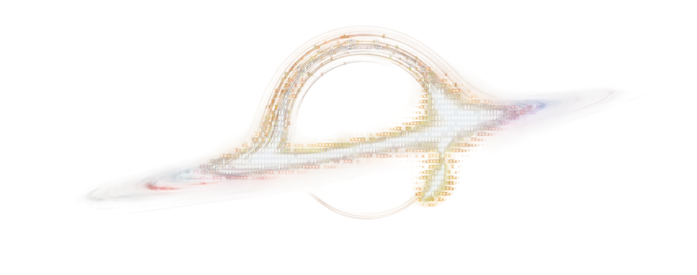

  

# 💫 About Me:
I'm currently building a database (PostgreSQL) as well as a Client and Staff Portal.  My previous projects included: 1. Designed and Wired a PC cluster 2. Local Movie and TV Series streaming server for my home 3. Scraped and visualized data on dashboards using Prometheus and Grafana 4. Designed an Automated Storage and Retrieval System. This process involved: Research, Calculations, CAD modelling

## 🌐 Socials:
 

# 💻 Tech Stack:
                 

# 📊 GitHub Stats:

  

  

